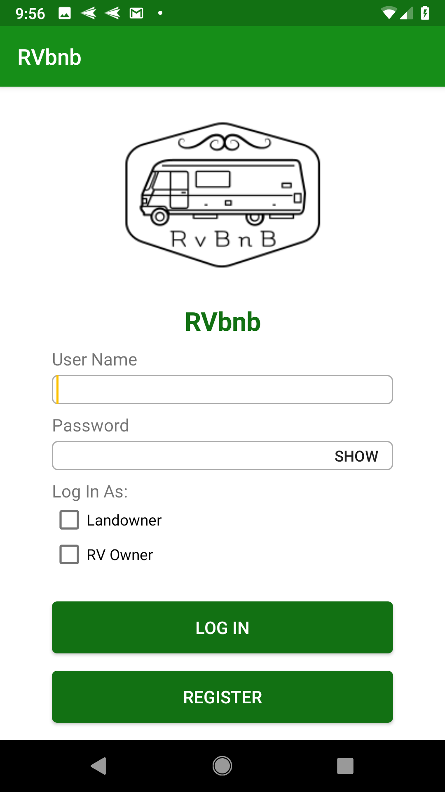
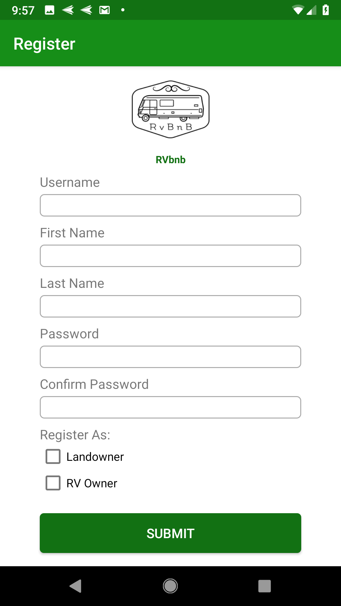
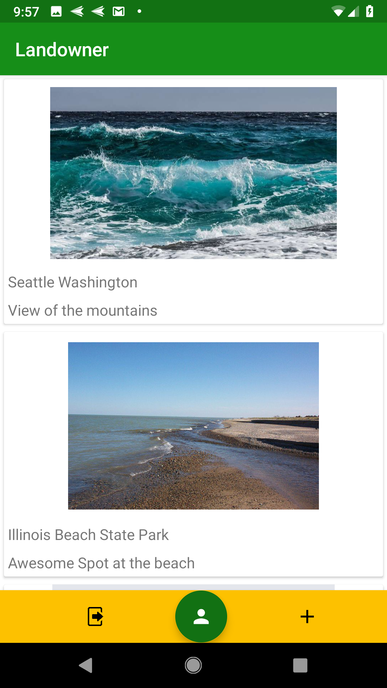
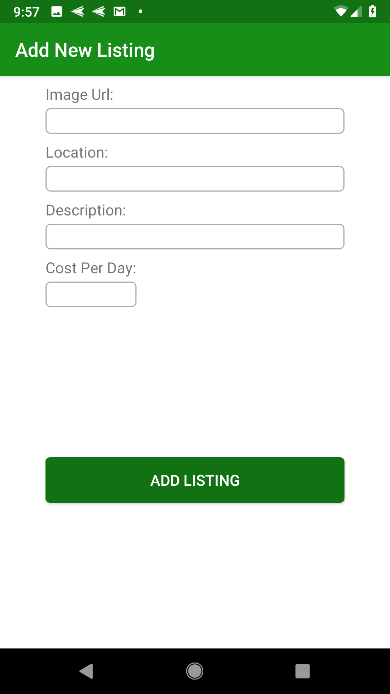
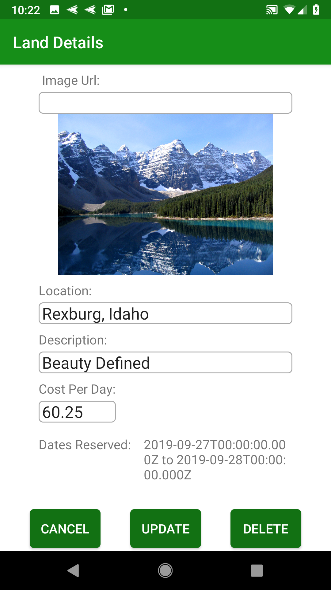
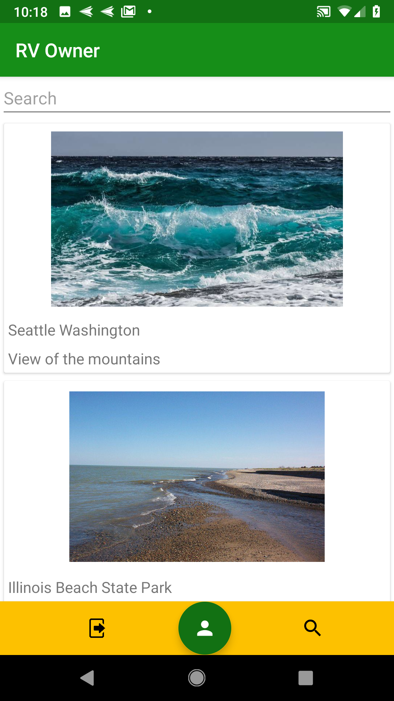
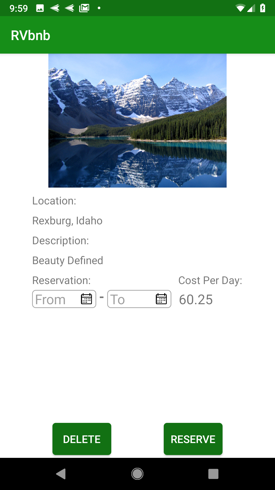
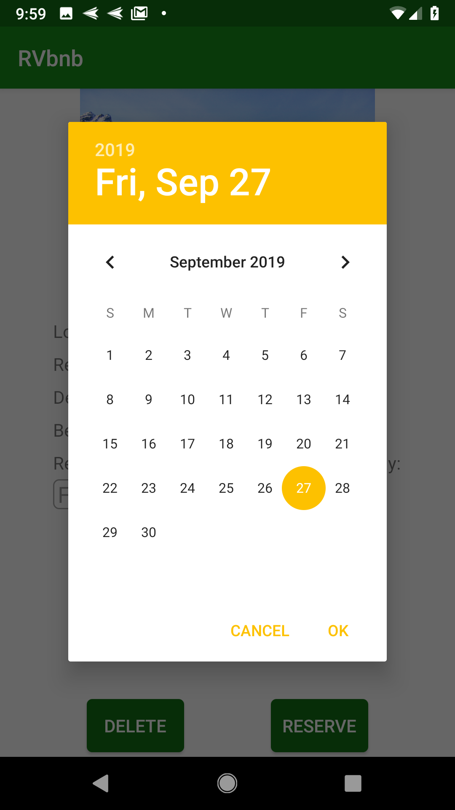
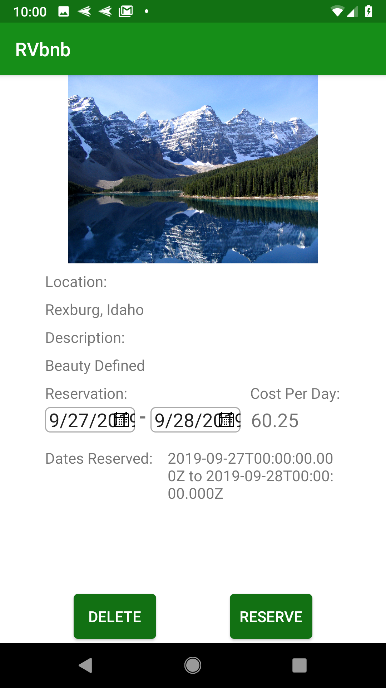

# Android: RVbnb

Do you have land that you're currently not using and would like to make some extra money? Create a Landowner user account through RVbnb and post a listing of your land on the app so that RV owners can make a reservation and use your land. 

Or if you're a RV owner, have you ever found RV parks over crowded or unavailable during your trip? Create a RV Owner user account through RVbnb and gain access to privately owned land that would have been previously unavailable to you.

RVbnb is a great app that connects landowners and RV owners together. 

## Login/Register Pages:
The user must login as either a Landowner or a RV Owner (must sign in as the account they registered for). If the user does not have an account, they can click on the "Register" button. On the registration page, the user must select whether they are registering as a Landowner or a RV Owner.

 

## Landowners:

The homepage shows a list of the land that have been added for RV owners to use (RecyclerView).

As a Landowner, you can add a listing, by clicking on the "+" button and provide information including an image, location, description, and cost per day. 

When the listing is clicked on from the homepage, the details of the listing are visible. As a Landowner, you can make updates to the listing or delete it. Also, can see the reservations that have been made by RV owners.

## RV Owners:

The homepage shows a list of land that is available to make reservations. As a RV Owner, you can narrow down the list by searching locations.

When the listing is clicked on from the homepage, the details of the listing are visible. As a RV Owner, you can select a start date and an end date to make a reservation. Once the user makes a reservation it will display on the listing. If the user would like to cancel/delete the reservation, the user would click on the reservation and hit the "Delete" button. 

  
